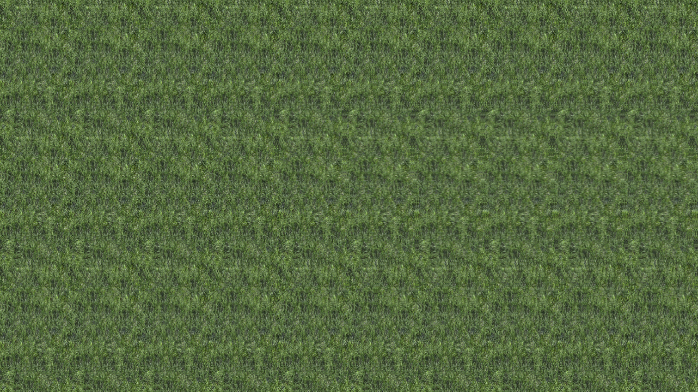

# Autostereogram Generator

This project is a Unity-based tool that lets you generate autostereograms in real-time using a custom shader.

Warning, the images get weird artifacts sometimes when too high displacement values are chosen. Not sure why...

## Features
- **Real-time generation**: Create and tweak autostereograms dynamically.
- **Shader-based implementation**: Uses a custom shader to render the effect efficiently.
- **Unity compatibility**: Developed in Unity 2022.3.36f, ensuring a modern and stable development environment.

## Installation
1. Clone this repository to your local machine:
   ```bash
   git clone https://github.com/yourusername/AutostereogramGenerator.git
   ```
2. Open the project in Unity 2022.3.36f or later.
3. Press Play to explore the real-time autostereogram generator.

## Usage
1. Run the Unity project in Play mode.
2. Adjust any parameters in the Inspector to modify the generated autostereogram.

## Contributing
Contributions are welcome! Feel free to submit a pull request or open an issue if you have suggestions, bug reports, or feature requests.

## License
This project is licensed under the [MIT License](LICENSE). Feel free to use, modify, and distribute as needed.
